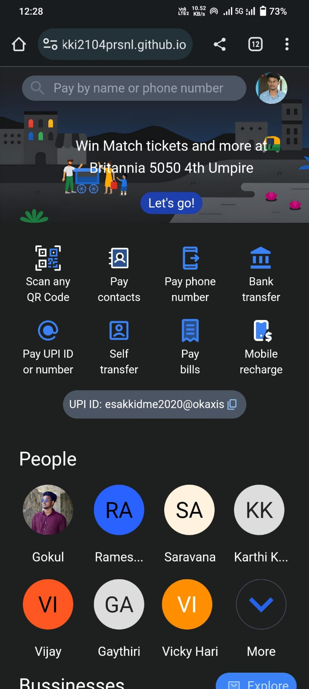
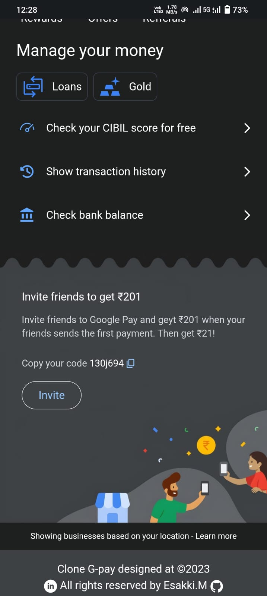

# Google Pay UI Clone Project






## Introduction

Welcome to the Google Pay UI Clone project! This open-source project aims to recreate the user interface of the Google Pay mobile application. Please note that this project is not affiliated with or endorsed by Google and is meant for educational and design purposes only.Here we using VITE framework to install required files to develope webpage

## Table of Contents


  - [Prerequisites](#prerequisites)
  - [Installation](#installation)
- [License](#license)

### Prerequisites

Before you begin, ensure you have met the following requirements:

- [Your development environment requirements (e.g., Node.js)]

### Installation

To get started with this project, follow these steps:

1. Clone this repository to your local machine:

   ```bash
   git clone https://github.com/esakki2104prsnl/gpay-using-tailwind.git

### License
MIT License &copy; All rights Reserved by Esakki.M